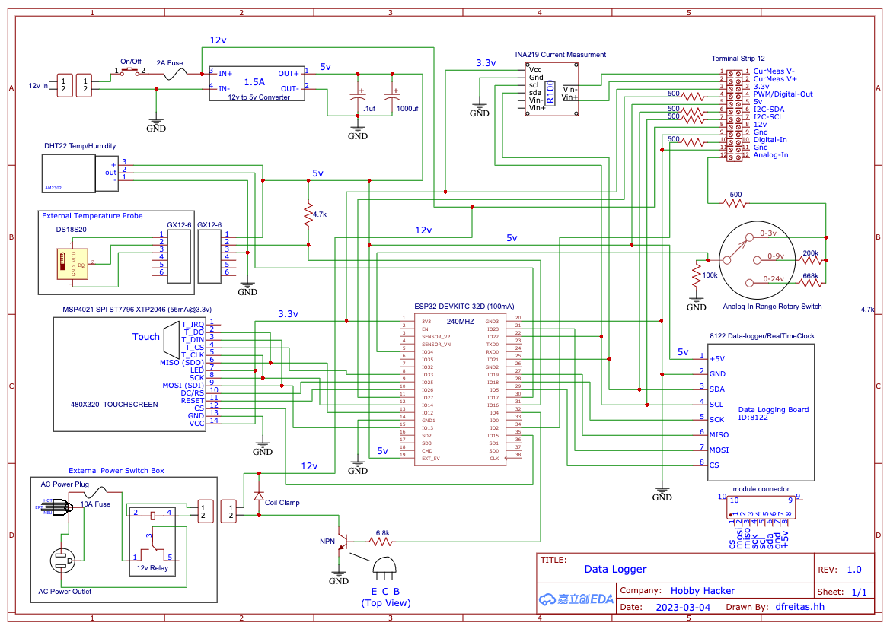

### **Data Logger Project Overivew** 
* Uses ESP32 for reasonably large program and data (160KB static-allocation, 160KB Dynamic Heap, 427KB Flash).
* Uses 480 X 340 color TFT touch screen display for the interface.
* Uses INA219 voltage/current module for high-side current monitoring
* Uses DTS18S20 external temperature probe and DHT22 temp/humidity module mounted to the chassis.
* An 8122 SD-CARD/RTC module is used for time keeping and logging measured results to a 32G SD card.
* Has a 12v relay control line that connects to an external 110V power outlet.  The power outlet is controllable manually via the touch screen or via alarm settings for the various measurements.
* There is a row of screw terminals on the back that bring out power, and signals (Ain, Din, Dout, I2C, current-measurement +/-).   The analog-in port has a  resistor divider knob that scales the input from 0-3, 0-9, or 0-24v).  If we wanted to get fancy we could replace this with relays to switch the range via software).
* The data logger is powered from a 12v external power supply (or we could plug in a 3S li-ion battery).   Current draw is about 180mA.  The 12v supply is dropped to 5v to supply the sensors and the 5v-in on the ESP32.

### **TFT Display**
* All commands are input and data displayed on the TFT-Touchscreen display.  The display interfaces with the ESP32 with SPI.  We use the Bodmer Graphics lib to drive the display.

* Noteworthy items:
    * The TFT has memory on the display itself.  We write pixel by pixel color values via the library (e.g. drawLine, drawString, drawButton).   This works well for text/shapes that do not change very often, however, for rapidly updating fields this would cause the screen to flicker if we tried to update the whole screen every time a value changed.

    * To eliminate flicker, subsets of the screen can be updated with small frame-buffers called “Sprites”.   Text/shapes can be loaded into a sprite then the sprite is written to the screen memory.  This way only a small part of the screen is updated very quickly.

    * The screen has a touch sensitive film incorporated that will sense the position of your finger and return the X/Y coordinate.   The library will check the X/Y location against defined “button” locations and return a “pressed” flag when the touch lands over a button shape.  This needs to be calibrated once after hooking up the ESP32 to the display.  The settings are then stored in the ESP using the SPIFFS file system.

### **SD-Card/RTC**
* Since the main purpose of a data logger is to capture data over a long period,  a real-time clock is used to keep accurate data/time and an SD-card interface is implemented to store large data sets for later analyzing.   Logged data is given the name  “measurement-type-Date-Time.csv”.

### **Current/Voltage Measuring**
* An INA219 is used to measure voltage and current to the IV+/IV-  pins on the screw-terminal.   Use it like you would a normal ammeter.  IV+ hooked to a power-source, IV- hooked to your load.  The load - connected to ground.   Current and Voltage will be displayed on the IV-monitor screen.   You can also view the results on a built in graph screen.  The axis for the graph can be adjusted.   The start writing the results to the SD-card, just push the “StartLog” button.   I/V will be measured for the duration and interval set on the IV setup screen.

* Alarms:  You can set a max current/voltage limit that, if exceeded, will trigger an alarm.  An alarm is a flag that is used by various “watchers”.   This include the 110V switched power module and the Dout pin.   For example, if the current exceeds the target limit, the 110v power box can be either turned on (say to fire up a fan) or turned off (as a fail-safe to shut down the power supply driving the IV load).

### **Temperature Measuring**
* Two different temperature measurements may be made.  One from an external temperature probe (weather proof) and one from an temp/humidity module mounted directly to the data logger.   Note that the temp/humidity module is slightly effected by the heat from the data logger circuitry.  I’ve noted about a 2 degree F higher value for it.

* As with the IV measurements, the temp/humidity can be monitored/logged/graphed and alarms can be set.

### **Analog-in/Digital-in**
* One analog-in and one digital-in pin are brought out to the terminal strip.  These can be used to monitor an analog voltage or a digital level/count.

* Caution should be used with the Analog-in pin as on the 0-3v range the pin is brought straight into an ESP32 pin.  You could physically damage the pin by over-volting it.  There is a sensitivity knob where a set of series resistors are inserted to provide a 0-9v and 0-24v range.

* The digital in pin can be used to count events or monitor a digital level.  Even though this input is fed to a series resistor before being connected to the ESP32, you should still not exceed 3.3v on the pin.

* Alarms may be set on “max-din_count” or “max-Ain-Voltage”.

* The input measurements may be monitored, logged or graphed,

### **Digital-Out**
* A digital out pin is brought out to the terminal strip.  This output is PWM enabled and can be set to a constant high, low, or a PWM duty-cycle (set at the D-Out setup menu).   The Dout value may also be controlled by an alarm.   The values on alarm are:
Low/High/PWM/PWM-inverted/None.

### **Clock**
* The RTC time is set during compile but may be changed manually on the clock menu.  Just set the Y/M/D/H/M/S and click “SetClk” to update it.

* You can also set an alarm time by clicking on the “SetAlrm”.   Enable the alarm with the AlarmOn/AlarmOff button.  When the alarm triggers, any “watcher” can act on the alarm just like acting on a measurement alarm.

### **110V Outlet**
* An external switched 110v output can be connected to the  data logger.   It can be manually switched on/off or can be switched on/off with either a measurement alarm or clock alarm.

### **Notable Coding Items**
* The main program name is:  ESP32_datalogger_class.   It uses libraries for the TFT display, IV module, RTC, Temperature probe, and SPI interface.   It also uses library files I wrote expressly for the data logger:  MyTouchScreen.h, MyDisplay.h, and MyFreeFonts.h.

* All the functions for handling screen details like buttons, labels, screen text, screen graphs, etc are implemented in the MyTouchScreen library.  Initially I created one screen object for each different menu used in the data logger, however, I quickly ran out of RAM.  This was very inefficient use of memory as I was storing all the screen overhead for all the screens but can only actually display one screen at a time…

* I changed the code to re-use similar screens (Setup screens.  graph screens, monitor screens, etc.) and save-off and re-load the independent screen values when switching screens.  This made for messier code, but saved significant memory.

* Note,  I have found that the Arduino IDE seems to pre-allocate static RAM in a larger degree compared to VSCode/platformIO.   With too many screens the Arduino IDE would die during compile (running out of bss) while platformIO would compile and then subsequently die during execution.   I believe this is due to my use of malloc in my library code when I was trying to reduce the static allocation.   Still investigating.

### **Screen handling**
* Most screens have a standard button/string layout.   A grid of four columns by six rows of buttons may be used.  The individual menus enable-visibility on the buttons they want to use.  All others are ignored,   There can be five rows of text  and five rows of “text-sprites” for the associated results.   Each screen can have a title at the top.

* To use the screen,  the code gets a handle to a given screen, then loads it with buttons/text/measurement variables to monitor, then calls the screen library to draw the screen.

* In the setup code section, we initialize all the screens, modules, serial-monitor, etc.

* In the main “for-loop” all the sensors are checked at a user-defined interval,  the touch-screen is scanned to see if the user is pushing a button.   If so, the associated button-callback is executed.   If no button is pushed, then the currently displaying screen is updated with the latest results and we loop back.

* We maintain a curScreenPtr pointer to the screen that is currently being displayed.  Then we can reference the various buttons/text fields relative to the pointer.

* When results are being logged, we can write up the three streams of results simultaneously.  We only log 25 points before pausing and writing them out to the SD card.  This keeps the memory usage small but prevents constant writing to the file system.  Once the data is written to the SD-card,  it can be ejected and plugged directly into a PC where the results can easily be used in spreadsheets, graphs,  and further analyzed.

